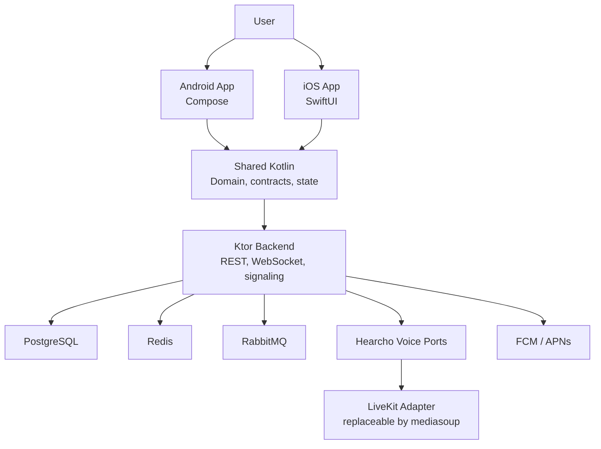
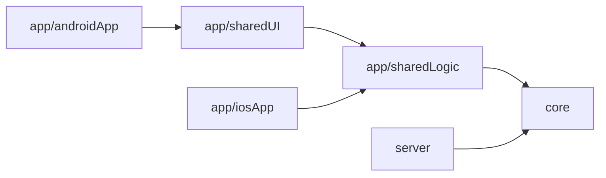
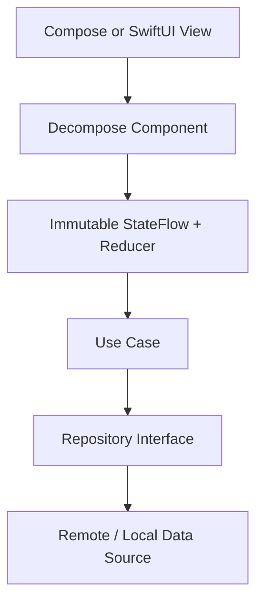
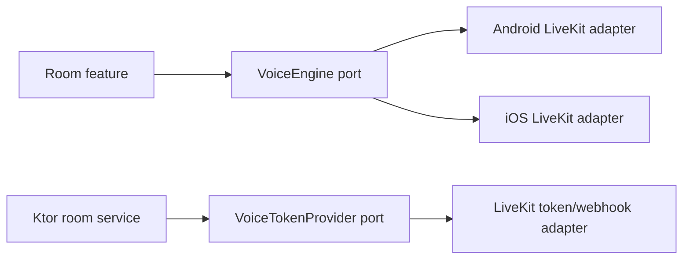

# Hearcho Architecture

Hearcho is a realtime voice communication system with shared Kotlin business logic, native mobile presentation layers, and a Ktor backend. The architecture optimizes for fast room discovery, low-latency participation, reliable room state, and safe community operations.

## Current vs. Target Architecture

The current repository uses the split-host scaffold described by ADR 0007:

- `core`: Android/iOS/JVM KMP module for contracts shared by clients and server.
- `app/sharedLogic`: Android/iOS KMP module exporting the static `SharedLogic` framework; no JVM target.
- `app/sharedUI`: Compose Multiplatform library with an Android target; no iOS target.
- `app/androidApp`: standalone Android application host.
- `app/iosApp`: SwiftUI Xcode host outside the Gradle module graph.
- `server`: Ktor JVM backend scaffold.

KMP Android libraries use `com.android.kotlin.multiplatform.library` and `androidLibrary {}`. Older `composeApp` and `androidTarget {}` examples do not describe this project.

The target architecture expands these modules into feature-oriented domains while preserving the same dependency direction.

## System Context



## Dependency Direction

Dependencies should flow inward toward stable domain contracts.



Rules:

- `core` must not depend on platform app modules.
- `app/sharedLogic` may depend on `core`, but should not depend on Android, SwiftUI, or server implementation details.
- `app/sharedUI` may depend on shared logic and Compose libraries.
- `app/sharedUI` currently targets Android only; iOS presentation is SwiftUI.
- `app/androidApp` owns Android-only setup and application wiring.
- `app/iosApp` owns SwiftUI and Apple framework integration.
- `server` may depend on `core` for shared contracts, but must not depend on mobile app modules.

## Module Responsibilities

### `core`

Purpose: stable, platform-independent primitives used by clients and backend.

Target responsibilities:

- Domain identifiers and value objects.
- Shared DTO/event contracts.
- Domain errors.
- Validation primitives.
- Time and feature-flag abstractions.
- Constants that must remain consistent across clients and server.

Avoid:

- Android imports.
- iOS imports.
- Ktor server implementation.
- UI state tied to a specific screen.

### `app/sharedLogic`

Purpose: shared client-side behavior for Android and iOS.

Target responsibilities:

- Client repositories and use cases.
- Ktor client abstractions.
- Room discovery state.
- Voice room state machine.
- Authentication/session state.
- WebSocket client state and event handling.
- Provider-neutral platform ports such as `VoiceEngine` and secure token storage.

### `app/sharedUI`

Purpose: shared Compose UI surfaces where Compose is the right abstraction.

Target responsibilities:

- Common Compose UI.
- Material 3 theme and component primitives.
- Android Compose UI shared between Android surfaces.
- Presentation state rendering that does not require native iOS controls.

Do not place business rules here. UI should render state and emit actions.

### `app/androidApp`

Purpose: Android app shell and Android integrations.

Target responsibilities:

- `MainActivity` and Android app startup.
- Permission orchestration.
- Audio focus and voice service integration.
- FCM.
- Location and maps adapters.
- Android-specific dependency wiring.

### `app/iosApp`

Purpose: iOS app shell and native Apple integrations.

Target responsibilities:

- SwiftUI app entry point and navigation.
- Apple Human Interface Guidelines alignment.
- `AVAudioSession`, CallKit, APNs, CoreLocation, MapKit.
- iOS permission prompts and privacy strings.
- Swift wrappers around shared Kotlin APIs where needed.

### `server`

Purpose: backend API, realtime gateway, and integration layer.

Target responsibilities:

- REST API.
- Authentication and session issuing.
- Ktor WebSocket gateway.
- Presence and room state synchronization.
- Provider-neutral media authorization and webhook handling through replaceable voice adapters.
- Database repositories.
- Outbox publishing to RabbitMQ.
- Push notification dispatch.
- Rate limiting, logging, metrics, and tracing.

## Target Feature Boundaries

The long-term shared feature layout should be introduced incrementally:

```text
shared/
├── core/
├── domain/
├── feature-auth/
├── feature-discovery/
├── feature-room/
├── feature-profile/
├── feature-notifications/
└── feature-settings/
```

Do not create all modules prematurely. Split only when a boundary has enough code or dependencies to justify it.

## Client State Architecture

Target client flow:



Guidelines:

- Decompose owns navigation, lifecycle, child components, and saved state.
- Feature components own immutable state, actions, pure reducers, and explicit side effects.
- `StateFlow` is the default observable boundary for realtime state.
- Orbit MVI remains outside the baseline. Arrow is scoped by ADR 0010 to `Either`, `Raise`, `NonEmptyList`, selective Optics, and `parZip`; it does not replace feature state, UI state, or project-owned failure semantics.
- Avoid storing transport objects directly in UI state.
- Model room, speaker, connection, and permission states explicitly with sealed types.

## Realtime Architecture

Realtime state is split into two channels:

- Voice media: handled by native WebRTC and SFU infrastructure.
- Product state: handled by Ktor WebSockets and shared event contracts.

Product realtime events include:

- User presence.
- Room participant changes.
- Speaking state.
- Hand raises.
- Reactions.
- Moderation actions.
- Room lifecycle changes.

Backend responsibilities:

- Authenticate WebSocket connections.
- Authorize room subscriptions.
- Emit ordered room events where ordering matters.
- Reconcile state on reconnect.
- Rate limit noisy events.
- Publish durable side effects through the outbox when needed.

## Voice Architecture

LiveKit is the selected first provider, but voice is accessed through provider-neutral ports. Domain models, feature components, Ktor room services, and public contracts use Hearcho terminology only.



Replacement rule: a mediasoup migration implements the same client and server ports, passes the same contract tests, and changes composition-root bindings. Provider-specific capabilities may enter shared behavior only after the neutral port is extended deliberately.

Android:

- Native LiveKit SDK inside the Android `VoiceEngine` adapter.
- `AudioManager`.
- Audio focus.
- Foreground service when required.
- Media notification controls if needed.

iOS:

- Native LiveKit Swift SDK inside the iOS `VoiceEngine` adapter.
- `AVAudioSession`.
- CallKit only if the product behavior satisfies Apple requirements.
- PushKit only for compliant VoIP call flows.

Shared Kotlin models voice session state but does not import LiveKit. Media capture, routing, interruption handling, and permissions stay native. Ktor authorizes media access and issues provider-neutral credentials through `VoiceTokenProvider`; LiveKit grants and secrets remain inside its server adapter.

## Persistence Architecture

### Server

PostgreSQL is the source of truth. Redis is used for ephemeral state and cache-like concerns. RabbitMQ handles asynchronous work and notification fan-out.

Durable asynchronous side effects should use the outbox pattern:

1. Write domain data and outbox event in the same database transaction.
2. Background publisher reads pending outbox events.
3. Publisher sends messages to RabbitMQ.
4. Workers mark events delivered or retry with backoff.

### Client

SQLDelight is planned for:

- Current user cache.
- Session metadata.
- Recent rooms.
- Recent searches.
- Notification history.
- Feature flags.

Multiplatform Settings is planned for:

- Tokens or token references.
- Theme.
- Small preferences.
- Lightweight settings.

Backend data remains authoritative.

## Security and Safety Architecture

Minimum early requirements:

- JWT or equivalent authenticated API sessions.
- Explicit room membership and role checks.
- Moderator actions represented as auditable events.
- Blocking and reporting flows.
- Rate limiting on auth, room creation, reactions, hand raises, and realtime events.
- Secure storage for client credentials.
- Privacy-first location usage with clear permission handling.

## Testing Architecture

Use tests at the boundary closest to the behavior:

- `core`: pure unit tests for value objects, validation, and event contracts.
- `app/sharedLogic`: coroutine and `StateFlow` tests for repositories, use cases, and state machines.
- `app/sharedUI`: Compose rendering and state rendering tests where supported.
- `app/androidApp`: Android integration and permission behavior tests.
- `app/iosApp`: XCTest/XCUITest for SwiftUI and native integration behavior.
- `server`: Ktor route tests, repository tests, WebSocket tests, and integration tests for database-backed behavior.

## Extension Rules

When adding a new feature:

1. Define product behavior in `docs/PRD.md` or the relevant feature document.
2. Add or update ADRs for irreversible technology or architecture choices.
3. Put platform-independent contracts in `core`.
4. Put shared client behavior in `app/sharedLogic`.
5. Put native platform behavior in `app/androidApp` or `app/iosApp`.
6. Put backend behavior in `server`.
7. Add tests at the lowest layer that proves the behavior.

## Architecture Governance

Keep architecture healthy with:

- ADRs for major decisions.
- Version catalog updates for dependency changes.
- Explicit dependency direction.
- Small feature slices before module splitting.
- Documentation updates in the same change as architecture changes.
