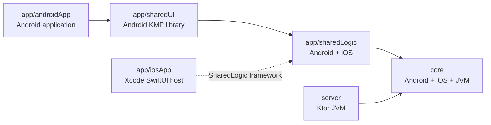

# Hearcho Project Structure

This is the top-down map of the current repository and the intended package placement within existing modules.

## Repository Tree

```text
Hearcho/
├── app/
│   ├── androidApp/       # Android application host
│   ├── iosApp/           # SwiftUI Xcode host, outside Gradle
│   ├── sharedLogic/      # Android/iOS shared client framework
│   └── sharedUI/         # Android-targeted Compose KMP library
├── core/                 # Android/iOS/JVM contracts and domain primitives
├── server/               # Ktor JVM backend
├── docs/
│   └── adr/
├── gradle/
│   └── libs.versions.toml
├── .env.example           # Local infrastructure and server configuration template
├── docker-compose.yml     # PostgreSQL, Redis, and RabbitMQ development stack
├── build.gradle.kts
├── settings.gradle.kts
├── gradle.properties
├── gradlew
└── skills-lock.json
```

## Gradle Module Graph



`settings.gradle.kts` includes five Gradle modules: `:app:androidApp`, `:app:sharedLogic`, `:app:sharedUI`, `:core`, and `:server`. The iOS host is built by Xcode.

## Build Model

- Root `build.gradle.kts` declares plugins with `apply false`.
- `gradle/libs.versions.toml` is the single source for Gradle dependency/plugin versions.
- `androidApp` uses `com.android.application` and top-level Android dependencies.
- KMP Android libraries use `com.android.kotlin.multiplatform.library` with `androidLibrary {}`.
- KMP source-set dependencies are declared inside `kotlin { sourceSets { ... } }`.
- `sharedLogic` exports a static framework named `SharedLogic` for iOS device and simulator arm64.

## Current Source Sets

### `app/androidApp`

```text
app/androidApp/src/main/
├── AndroidManifest.xml
├── kotlin/dev/kavrin/hearcho/MainActivity.kt
└── res/
```

Owns the Android application lifecycle, app composition root, Compose host, Android permissions, FCM, audio routing/focus, foreground behavior, maps/location adapters, secure storage, and the native LiveKit adapter.

### `app/sharedUI`

```text
app/sharedUI/src/
├── commonMain/
│   ├── composeResources/
│   └── kotlin/dev/kavrin/hearcho/App.kt
└── commonTest/
```

This module currently has only an Android target even though its UI code lives in `commonMain`. It is not an iOS UI module. It owns Compose screens, theme, reusable components, and state rendering; it does not own business rules.

### `app/sharedLogic`

```text
app/sharedLogic/src/
├── commonMain/
├── commonTest/
├── androidMain/
├── androidHostTest/
├── iosMain/
├── iosTest/
├── jvmMain/              # generated directory currently present, not a configured target
└── jvmTest/              # generated directory currently present, not a configured target
```

Configured targets are Android, iOS arm64, and iOS simulator arm64. The present `jvmMain`/`jvmTest` files are not compiled because this module has no JVM target; remove or relocate them when replacing generated placeholders.

Owns shared repositories, use cases, Decompose components, immutable state/reducers, Ktor client, WebSocket client, local data access, and provider-neutral platform ports such as `VoiceEngine` and secure token storage.

### `app/iosApp`

```text
app/iosApp/
├── Configuration/Config.xcconfig
├── iosApp.xcodeproj/
└── iosApp/
    ├── iOSApp.swift
    ├── ContentView.swift
    ├── Info.plist
    └── Assets.xcassets/
```

Owns SwiftUI screens and wrappers, Xcode configuration, Keychain, APNs, `AVAudioSession`, CoreLocation, MapKit, permissions, and the native LiveKit `VoiceEngine` adapter. It consumes shared Kotlin through the `SharedLogic` framework.

### `core`

```text
core/src/
├── commonMain/
├── commonTest/           # create when the first contract tests are added
├── androidMain/          # source set configured; directory may be absent
├── androidHostTest/      # source set configured; directory may be absent
├── iosMain/              # hierarchy template source set; directory may be absent
├── iosTest/              # hierarchy template source set; directory may be absent
├── jvmMain/              # target configured; directory may be absent
└── jvmTest/              # target configured; directory may be absent
```

Owns provider-neutral domain identifiers, value objects, validation, API DTOs, realtime event contracts, error codes, pagination, and media credential contracts. It must not contain UI, server implementation, or voice-provider SDK types.

### `server`

```text
server/src/
├── main/
│   ├── kotlin/dev/kavrin/hearcho/
│   │   ├── Application.kt
│   │   ├── bootstrap/
│   │   └── diagnostic/
│   └── resources/logback.xml
└── test/kotlin/dev/kavrin/hearcho/
    ├── ApplicationTest.kt
    ├── README.md
    ├── bootstrap/
    ├── diagnostic/
    └── testfixture/
```

The server is Ktor on JVM, not Spring Boot. It owns routes, authentication, application services, Exposed repositories, Flyway migrations, Redis presence, RabbitMQ workers/outbox publishing, OpenTelemetry, and provider adapters such as `LiveKitVoiceTokenProvider`.

## Intended Internal Packages

Create these packages incrementally as roadmap tasks require them; do not create empty directories.

```text
core/.../
├── domain/               # IDs, value objects, rules
└── contract/             # HTTP, WebSocket, media credential contracts

app/sharedLogic/.../
├── app/                  # root component and composition
├── feature/              # auth, discovery, room components
├── data/                 # remote/local data sources and repositories
└── platform/             # provider-neutral ports

server/.../
├── bootstrap/            # Ktor plugins and configuration
├── auth/                 # auth domain/application/routes
├── room/                 # room domain/application/routes
├── realtime/             # Ktor WebSocket gateway
├── persistence/          # Exposed, Hikari, Flyway integration
├── messaging/            # outbox and RabbitMQ adapters
└── voice/
    ├── application/      # provider-neutral ports and policies
    └── livekit/          # LiveKit-only adapter code
```

Android and iOS voice code follows the same boundary: feature code sees `VoiceEngine`; only the native adapter sees LiveKit. A mediasoup migration adds new adapters and changes composition-root bindings.

## Placement Guide

| Work | Location |
| --- | --- |
| Shared domain ID or API/event contract | `core/src/commonMain` |
| Shared client use case/component/reducer | `app/sharedLogic/src/commonMain` |
| Provider-neutral client platform port | `app/sharedLogic/src/commonMain` |
| Android port or LiveKit implementation | `app/androidApp` or `app/sharedLogic/src/androidMain` when it must export through KMP |
| Compose screen | `app/sharedUI/src/commonMain` |
| SwiftUI screen or LiveKit Swift adapter | `app/iosApp/iosApp` |
| Ktor route/application service | `server/src/main/kotlin` |
| LiveKit server adapter | `server/.../voice/livekit` |
| Flyway SQL migration | `server/src/main/resources/db/migration` once created |
| ADR | `docs/adr` |

## Module Split Policy

Keep feature packages inside current modules through the MVP. Split a feature into another Gradle module only when it has a stable API and the split improves build isolation, dependency enforcement, or ownership. Update the module graph, structure document, validation matrix, and an ADR together.
